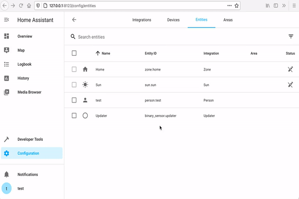

# Robert-Koch Institut COVID Numbers

[](https://github.com/thebino/rki_covid/graphs/contributors)

[](https://github.com/custom-components/hacs)

The `rki_covid` component is a Home Assistant custom sensor for monitoring regional covid numbers in Germany.


## Table of contents
* [Installation](#installation)
  * [Install with HACS](#install-with-hacs)
  * [Install manually](#install-manually)
* [Configuration](#configuration)
  * [Configuration via User interface](#user-interface)
  * [Configuration via configuration.yaml](#configurationyaml)
* [Entities](#entities)
* [Graph](#graph)
* [Automations](#automations)
* [Contribution](#contribution)

## Installation
### Install with HACS (recommended)
1. Ensure that [HACS](https://community.home-assistant.io/t/custom-component-hacs) is installed.
2. Search for and install the "RKI Covid numbers" integration.
3. Configure the `rki_covid` sensor.
4. Restart Home Assistant.

#### Install manually
1. Download the [latest release](https://github.com/thebino/rki_covid/releases/latest).
2. Unpack the release and copy the `custom_components/rki_covid` directory
   into the `<config dir>/custom_components` directory of your Home Assistant installation.
3. Configure the `rki_covid` sensor.
4. Restart Home Assistant.


## Configuration

#### User interface
Open the `Configuration` of your Home-Assistant instance and select `Integrations`.
Add a new integration, search and select `rki covid`.
A dialog appears to select a district or state to monitor.
After submitting the dialog, the newly added sensor entity is available.

**Hint:** Repeat the process to add multiple districts or states.



#### Configuration.yaml
It is also possible to add districts / states via the `configuration.yaml`.
Open your configuration file in an editor.
Add a new sensor platform called `rki_covid` and add a list of districts by name.

```yaml
sensor:
  - platform: rki_covid
    baseurl: 'https://api.corona-zahlen.org'
    districts:
     - name: 'SK Augsburg'
     - name: 'SK Berlin Mitte'
     - name: 'BL Bayern'
     - name: 'LK München'
```

`baseurl` is optional to support local instances of [rki-covid-api](https://github.com/marlon360/rki-covid-api)

**Hint:** You have to validate the configuration (`Configuration > Server Controls > Check configuration`) and restart Home Assistant before the new sensors become available.


## Entities

Each integration creates multiple entities in the format `sensor.NAME_entity`.

|Sensor  |Type|Description
|:-----------|:---|:------------
|`sensor.NAME_count`| number | indicates the confirmed cases.
|`sensor.NAME_newCases`| number | indicates the new confirmed cases.
|`sensor.NAME_deaths`| number | indicates the numbers of confirmed death cases.
|`sensor.NAME_newDeaths`| number | indicates the numbers of new confirmed death cases.
|`sensor.NAME_recovered`| number | indicates the numbers of confirmed death cases.
|`sensor.NAME_newRecovered`| number | indicates the numbers of new confirmed death cases.
|`sensor.NAME_casesPer100k`| number | indicates cases per 100k.
|`sensor.NAME_weekIncidence`| number | indicates the week incidence per 100.000 inhabitants.


## Graph
Home-Assistant has built-in cards for graphs wich could be really helpful to display the current count with history.

```yaml
type: sensor
graph: line
detail: 1
name: 'München '
entity: sensor.sk_munchen_weekincidence
hours_to_show: 72
```


#### Automations
For automations have a look on the [trend](https://www.home-assistant.io/integrations/trend/) platform.


## Contribution
See [Contribution](CONTRIBUTING.md) for details.
